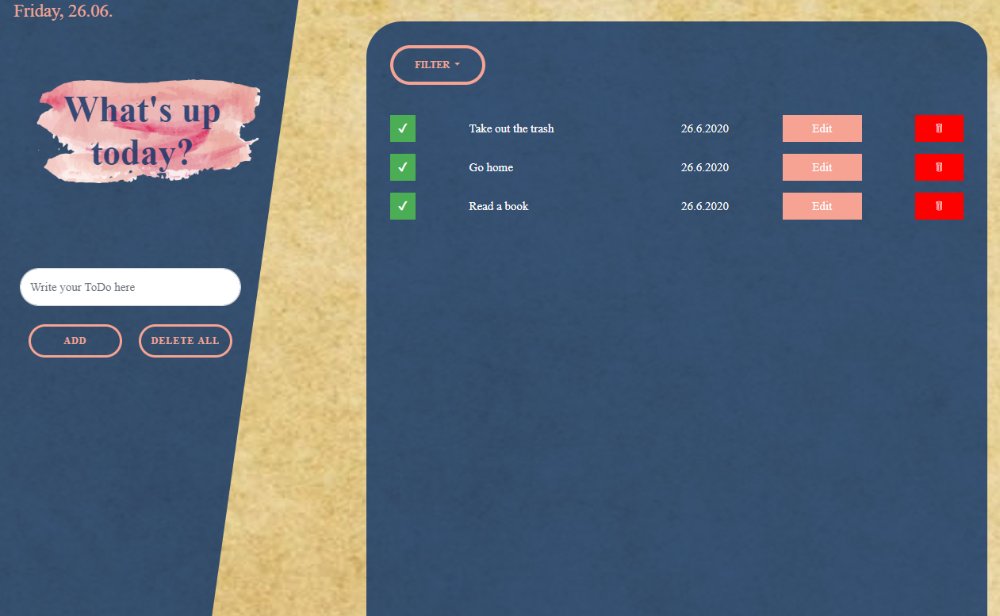

## A simple ToDo-List Application

You can manage your todos with this web-application.
The items are persisted in local storage.

You can filter your items to see all items / only the not completed items / the completed items.

There is no installation required.

